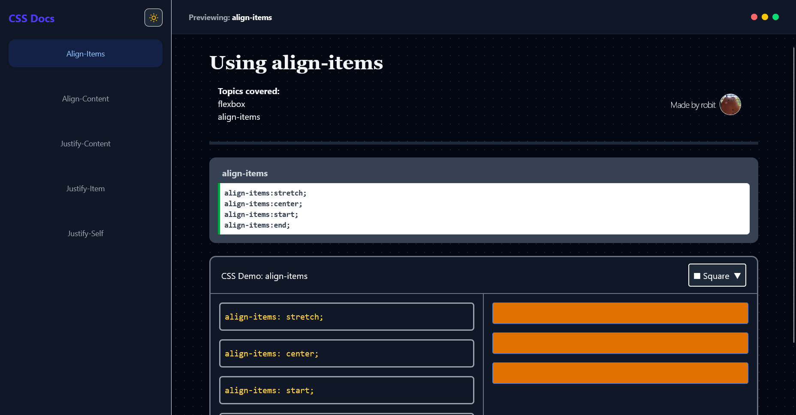

# cssdocs : The Interactive CSS Handbook

A high-performance, visual-first learning platform for modern CSS. Unlike traditional documentation, this project focuses on **constrained interaction**, allowing developers to "feel" how CSS properties behave through curated UI controls rather than manual coding.

---

## Technical Stack

* **Framework:** [React](https://reactjs.org/) (Functional Components & Hooks)
* **Styling:** [Tailwind CSS](https://tailwindcss.com/) (For the UI and the Demo outputs)
* **Pattern:** Configuration-Driven UI (Render Props & State Lifting)

---

## Demo



## Project **Structure**

The project is built on a modular "Shell & Kernel" architecture:

1. **The Shell (`OutputComponent`):** A flexible, reusable wrapper that handles the layout, shape-selection logic, and button menus.
2. **The Kernel (Property Pages):** Specific files (e.g., `AlignItems.jsx`) that define the CSS logic and the specific demo rendering function.

### Example Logic Flow

```javascript
// Define your CSS variations
const outputPanel = {
    'title': "CSS Demo: align-items",
    'buttons': [
        { 'name': 'align-items: center;', 'state': 'items-center' },
        // ...
    ],
    'output': (state, shape) => (
        <div className={`flex flex-col ${state}`}>
            <span className={shape.style}>Box 1</span>
        </div>
    )
}

```

## Installation Guide

### 1. Clone the Repository

```bash
git clone https://github.com/robitcode/cssdocs
cd cssdocs
```

### 2. Install Dependencies

```bash
# Using npm
npm install
```

### 3. Run the Development Server

```bash
npm run dev
```

Open <http://localhost:5173> to see the platform in action.

---

### Adding a New Property Page

To add a new CSS property (e.g., `flex-wrap`):

1. **Create the file:** `src/pages/properties/FlexWrap.jsx`
2. **Define the config:** Create your `outputPanel` object.
3. **Register the route:** Add it to your `App.jsx` or router file.

### Component Recipe Template

```jsx
const outputPanel = {
    title: "CSS Demo: flex-wrap",
    buttons: [
        { name: 'flex-wrap: nowrap;', state: 'flex-nowrap' },
        { name: 'flex-wrap: wrap;', state: 'flex-wrap' },
    ],
    output: (state, shape) => (
        <div className={`flex w-48 border border-dashed ${state}`}>
            <div className={`w-20 h-20 bg-blue-500 ${shape.style}`} />
            <div className={`w-20 h-20 bg-red-500 ${shape.style}`} />
            <div className={`w-20 h-20 bg-green-500 ${shape.style}`} />
        </div>
    )
};

```

## Features

### 1. Shape Switching

Switch between **Square (Fixed)** and **Circle (Fluid)** modes.

### 2. Responsive Demo Stages

The `OutputComponent` automatically switches from a side-by-side view on Desktop to a stacked view on Mobile, ensuring the demo area remains visible while interacting with the controls.

### 3. State-Synchronized Headers

Every property page includes a `HeaderComponent` and `DetailComponent` to provide the technical theory alongside the visual practice.

---

## 🤝 Contributing

This project is built for the community. If you want to add a new CSS property visualizer:

1. Create a new component in `src/pages/properties/`.
2. Follow the `outputPanel` configuration pattern.
3. Submit a Pull Request!

---

## Contributers


